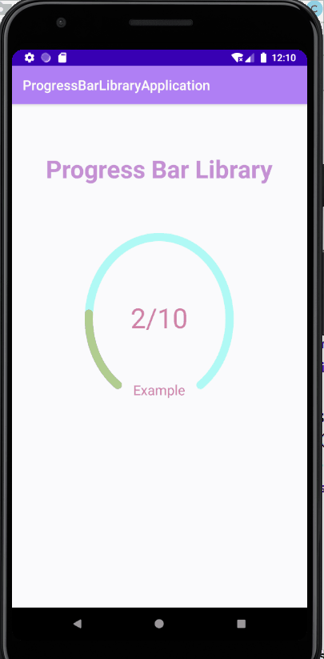
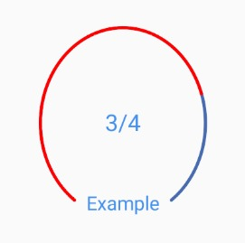
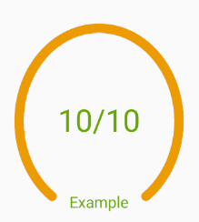

# LibraryProgressBar

[](https://jitpack.io/#MelanyCG/LibraryProgressBar)

Library for creating a progress bar that shows how many steps were made out of the total.
Have fun!

## Setup
Step 1. Add it in your root build.gradle at the end of repositories:
```gradle
allprojects {
    repositories {
        maven { url 'https://jitpack.io' }
    }
}
```

Step 2. Add the dependency:
```gradle
dependencies {
     implementation 'com.github.MelanyCG:LibraryProgressBar:1.00.02'
}
```
## Usage


## How to use - Basic progress bar:
1. Add this code to your xml layout activity: 
```java
    <com.example.progressbarlibrary.MyProgressBar
        android:id="@+id/myProgressBar"
        android:layout_width="218dp"
        android:layout_height="251dp"
        android:layout_centerHorizontal="true"
        android:layout_marginTop="70dp"
        app:layout_constraintDimensionRatio="1:1"
        app:bottom_text="Example"
        app:bottom_text_size="25dp"/>
```

2. Add this code to your main:
```java
        myProgressBar = findViewById(R.id.myProgressBar);
        myProgressBar.setText(3,4);
```

# Usage


## How to use - A progress bar that advanced until the end:
1. Add this code to your xml layout activity: 
```java
    <com.example.progressbarlibrary.MyProgressBar
        android:id="@+id/myProgressBar"
        android:layout_width="218dp"
        android:layout_height="251dp"
        android:layout_centerHorizontal="true"
        android:layout_marginTop="70dp"
        app:layout_constraintDimensionRatio="1:1" />
```
2. Add this attribute:
```java
        public void handleMessage(Message msg) {
            String text = myProgressBar.getText();
            String[] progress = text.split("/");

            int firstNumber = Integer.parseInt(progress[0]);
            int secondNumber = Integer.parseInt(progress[1]);
            firstNumber = firstNumber + 1;

            myProgressBar.setText(firstNumber, secondNumber);
            if(progress[0] == progress[1]) {
                myProgressBar.setBottomText("Done!");
            }
            mTimedHandler.sendEmptyMessageDelayed(0, 1000);
        }
    };
```
3. Add this code to your main:
```java
        myProgressBar = findViewById(R.id.myProgressBar);

        // Random the colors of the arc progress bar and the text of the progress bar.
        Random rnd = new Random();
        int finishColor = Color.argb(255, rnd.nextInt(256), rnd.nextInt(256), rnd.nextInt(256));
        int unFinishColor = Color.argb(255, rnd.nextInt(256), rnd.nextInt(256), rnd.nextInt(256));
        int textColor = Color.argb(255, rnd.nextInt(256), rnd.nextInt(256), rnd.nextInt(256));

        myProgressBar.setText(1,10);
        myProgressBar.setStrokeWidth(30);
        myProgressBar.setTextSize(100);
        myProgressBar.setTextColor(textColor);
        myProgressBar.setUnfinishedStrokeColor(unFinishColor);
        myProgressBar.setFinishedStrokeColor(finishColor);
        myProgressBar.setBottomText("Example");
        myProgressBar.setBottomTextSize(50);

        mTimedHandler.sendEmptyMessageDelayed(0,5);
```

# Usage


## License

    Copyright 2020 Melany Cygiel Gdud

    Licensed under the Apache License, Version 2.0 (the "License");
    you may not use this file except in compliance with the License.
    You may obtain a copy of the License at

       http://www.apache.org/licenses/LICENSE-2.0

    Unless required by applicable law or agreed to in writing, software
    distributed under the License is distributed on an "AS IS" BASIS,
    WITHOUT WARRANTIES OR CONDITIONS OF ANY KIND, either express or implied.
    See the License for the specific language governing permissions and
    limitations under the License.
